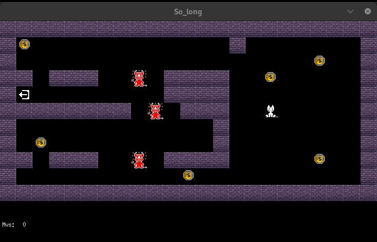

so_long

##

so_long is a beginner-level game development project from 42School. Using C and the MiniLibX library, the goal is to create a 2D game where a player navigates a map to collect items and reach the exit. The map, defined in a .ber file, includes walls (1), empty spaces (0), collectibles (C), the player's start (P), and the exit (E). The game handles user inputs for player movement and dynamically updates the game state. Key learning areas include basic game loops, 2D graphics rendering, event handling, and memory management. This project introduces essential skills for game programming and low-level development.


## Features and Gameplay

- **2D Graphics**: Utilizes the MiniLibX library for rendering graphics and managing the game window.
- **User-Created Maps**: Play on various user-created maps with different challenges. The maps can be found under resources/maps.
- **Simple Controls**: The character moves using the arrow keys.
- **Collect Items**: Gather all coins to unlock the exit. 
- **Avoid Obstacles**: Dodge enemies and obstacles that try to block your path. Touching an enemy will exit the game.
- **Memory Management**: Efficient memory handling to ensure there are no memory leaks and the game runs smoothly.


## Installation

1. Clone the repository:
    ```bash
    git clone git@github.com:mihaellatocu/so_long_new.git so_long
    cd so_long
    ```

2. Build the project:
    ```bash
    make
    ```

3. Run the game with a specified map:
    ```bash
    ./so_long resources/maps/map_6.ber
    ```


